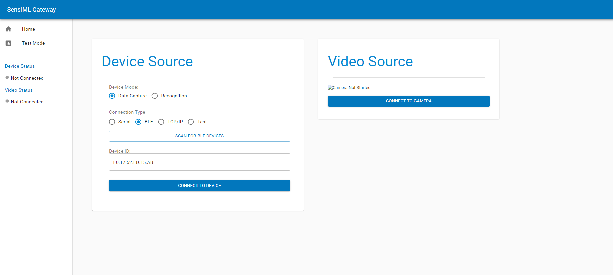
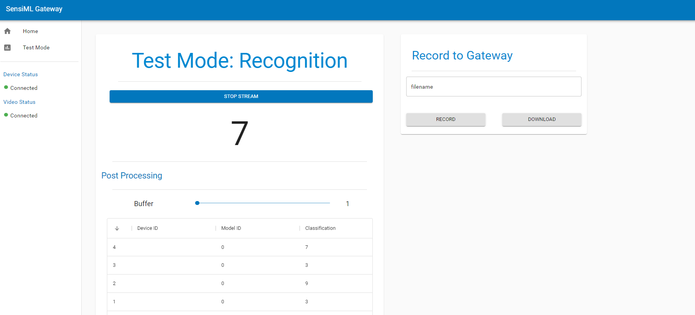

**NOTE** This is currently in alpha, we expect stable operation for streaming for BLE, TCPIP, and Serial. However, you may run into issues with the errors not being propagated to the UI. If you see issues please open a ticket. Additionally, some of the APIs may still change in the future.

# SensiML Gateway

This SensiML Gateway implements the [Simple Streaming Service protocol](https://sensiml.com/documentation/simple-streaming-specification/introduction.html) to enable forwarding data to the SensiML Data Capture Lab for recording and annotation. The Gateway supports connecting to sensors sources over a Serial, BLE, and TCP/IP connections. It also supports recording video and sensor data locally to the gateway.

## Installation

To install the app dependencies run

```bash
cd simple-streaming-gateway
pip install -r requirements.txt
```

To Start the application run

```bash
python3 app.py
```

## Installation (Windows, Mac)

Currently the application uses bluepy for BLE connections on linux, which is not supported on windows or Mac. We have experimental support for BLE on windows/OSx using bleak. If you are installing for windows, remove bluepy as a dependency in requirements.txt.

## Usage

The Gateway must first be configured to record data from your target sensor. It does that by fetching a configuration json from the source device. You can scan for devices connected over Serial and BLE. The gateway does not support scanning for TCP/IP devices, these addresses must be entered manually into the device id field as <address:port>.



After fetching the configuration your gateway will connect to the device. When connected you will see a Device: Connected status on the left navigation bar. When connected, the Gateway is able to forward sensor data from the source device to the SensiML Data Capture Lab which is used to record and annotate sensor data.

## Data Collection over Serial Source

    1. Connect edge node to Gateway over USB serial
    2. Go to Gateway Configure Screen, Select Serial Radio and Click Scan
    3. Enter the Device ID (which is the port) into the Text Field and Click Configure
    4. The SensiML Gateway is now configured to Stream Data from your Device over Wi-Fi

**NOTE** The BAUD RATE for the serial connection can be changed in the app.py by updating the default BAUD_RATE configuration.

## Data Collection from TCP/IP Source

    1. Connect edge node to network
    2. Go to Gateway Configure Screen, Select TCP/IP Radio Button
    3. Enter the Device ID (address:port) into the Text Field and Click Configure
    4. The SensiML Gateway is now configured to Stream Data from your Device over Wi-Fi

## Data Collection over BLE Source

    1. Connect edge node to Gateway over USB serial
    2. Go to Gateway Configure Screen, Select BLE Radio and Click Scan
    3. Enter the Device ID (which is the port) into the Text Field and Click Configure
    4. The SensiML Gateway is now configured to Stream Data from your Device over Wi-Fi

## Data Capture and Recognition Mode

Data Capture is for capturing raw sensor data, Recognition is for viewing classification results from machine learning models.

### Data Capture


### Recognition

As well as the recognition results stream whcih shows the classification and model ID.



### Recording Video

In the Gateway Status screen you can start and stop a video source. If you start the video source, it will be recorded along with sensor data when you click the Record Button in the Record to Gateway Widget in Test Mode. You can then download the file to your local machine by hitting the Download Button.


## BLE Troubleshooting on Linux

**NOTE** To use Bluethooth as a source you may have to run the following to allow bluepy-helper to access the correct permissions

```bash
find ~/ -name bluepy-helper
cd <PATH>
sudo setcap 'cap_net_raw,cap_net_admin+eip' bluepy-helper
```

### Cycle Bloothooth on Linux

Sometimes your BLE gets stuck in a weird state and you need to reset it. Instead of cycling the power, just run this command in your shell. You may also need to power cycle the device.

```base
rfkill block bluetooth && rfkill unblock bluetooth
```

### Disable onboard bluetooth raspberry pi (if you have a dongle)

We have noticed some issues with the raspberry pi BLE data drivers when using a camera and streaming data. We recommend using a dongle for video capture and ble streaming on the rpi. To disable the onboard BLE

add the line to /boot/config.txt

```bash
dtoverlay=disable-bt
```

run the commands, you should see only a single output which is the plugged in usb at hcl0 now

```bash
sudo systemctl stop hciuart and sudo systemctl disable hciuart.
sudo hcitool dev
```
